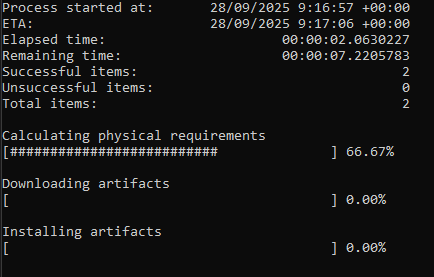
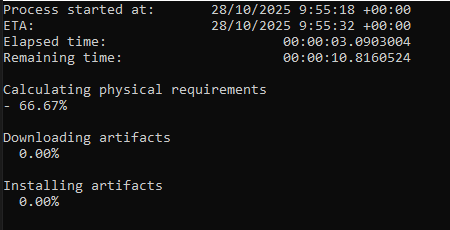
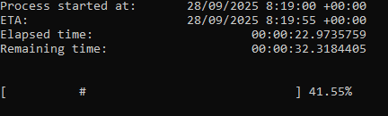
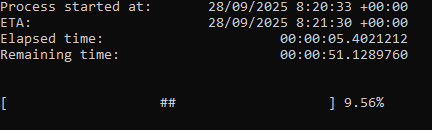

# Progress

This library provides a set of features that help you spin up reporting tasks, either in the form of console apps that show workloads progression or via background jobs providing access to stats during the lifespan of the workload.

Please read the documentation for further info about how to interact with the library's API here:
[Library API](./src/Progress/Content/README.md)

## Reporters
The reporter is the key component that orchestrates, provides and display information about the workloads progression. The following reporters are currently supported:

|Reporter| Description|
|---|---|
| **ConsoleReporter** | Reports progression of a single workload. Console based |
| **ConsoleAggregateReporter** | Reports progression of many workloads. Console based |
| **BackgroundReporter** | Reports progression of a single workload in background. Used in HostedService or other background jobs that don't require a std output |

## Supported features 
The following are the supported features:

| Feature | Description | Reporters | 
| ---| --- | --- |
| On progress stats  | Provides stats info during the reporting process | ConsoleReporter, ConsoleAggregateReporter, BackgroundRepoerter |
| On completeion stats | Provides stats info once the reporting finishes | ConsoleReporter, ConsoleAggregateReporter, BackgroundRepoerter |
| Exports | Exports the final stats to: json, txt, csv or xml | ConsoleReporter, ConsoleAggregateReporter, BackgroundRepoerter |
| Display data points | Display important data points such as: starting time, ETA, elaspsed time, remaining time, success, failures and total hits | ConsoleReporter, ConsoleAggregateReporter |
| Display workload progression | Display progress with different types of components | ConsoleReporter, ConsoleAggregateReporter |

## Components
The components are meant for console-based reporters, aiming to display progression during the lifespan of the workload. When using the *ConsoleAggregateReporter* one can choose and use different components or use the same for all workloads.

### Progress bars

### Spinners

### Pulse

### Hearthbeat

